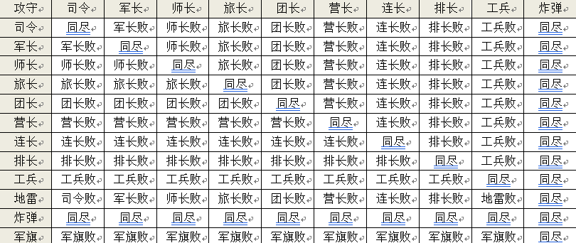
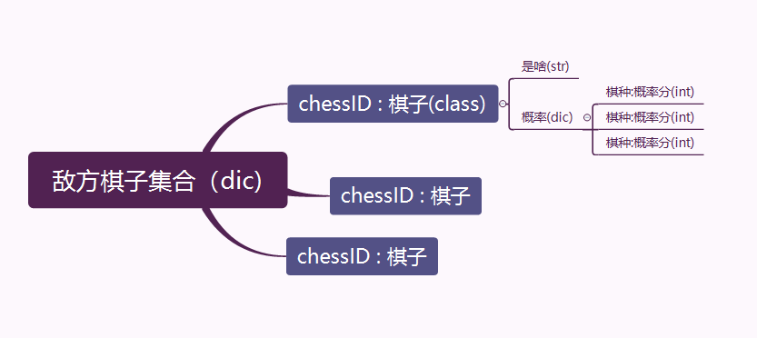
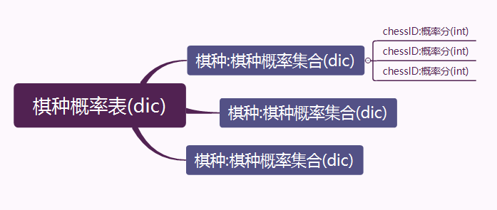

# 重构

> 原版的代码过于鬼屎，整理麻烦，重新做一个吧

# 军棋协议

## 棋盘约定

### 1.棋盘编码&布局

​	军棋棋盘共有12行5列60个棋位，行编码从上到下依次为A，B，C……K，L；列编码从左到右依次为0，1，2，3，4；每个棋位用行号和列号顺序表示见图1

​	己方应在下方棋盘的棋位上布置棋子，对方在上方棋盘的棋位上布置棋子。    布阵时选手只能将己方的25枚棋子扣放在本方区域的兵站和大本营中（军旗必须放在大本营中；地雷必须放在最后两排；炸弹不能放在第一排，行营中不能布子。）

### 2.棋子编码布局

| 名称 | 司令 | 军长 | 师长 | 旅长 | 团长 | 营长 | 连长 | 排长 | 工兵 | 地雷 | 炸弹 | 军旗 |
| ---- | ---- | ---- | ---- | ---- | ---- | ---- | ---- | ---- | ---- | ---- | ---- | ---- |
| 编号 | a    | b    | c    | d    | e    | f    | g    | h    | i    | j    | k    | l    |
| 数量 | 1    | 1    | 2    | 2    | 2    | 2    | 3    | 3    | 3    | 3    | 2    | 1    |

### 3.行棋规则

* 发生碰子由裁判将碰棋输赢结果通知双方，然后双方轮流行棋，直到根据和棋或输赢规则结束棋局。

* 军棋、地雷、大本营棋子不可以移动

* 棋子沿公路线移动时每次只能走到相邻的停靠点

* 工兵沿铁路线移动时可不限格数直行或转弯到达铁路线上未被阻挡的任何兵站，其它棋子沿铁路线移动时不可转弯只可不限格数沿直线移动到未被阻挡的兵站。

  

* 结束对局后，按以下顺序优先判定胜负：
  * 行棋着法非法的一方为负；
  * 双方都无棋可走为和棋，只有一方无棋可走的一方为负；
  * 军旗被吃或被炸的一方为负；
* **某一方行棋累计时间先超过30分钟为负**

## 编码约定

#### 示例：

> INFO 1.0                                                          裁判告知选手协议版本，询问参赛选手信息
>
> **NAME 参赛选手姓名                                   选手回复姓名**
>
> START 1 1800 31                                            裁判告知选手行棋先后顺序，每局时限，必攻步数
>
> **ARRAY abccddeeffggghhhiiijjkklj          选手回复布局序列**
>
> GO 0000 0 00                                                  裁判告知先行选手可行棋
>
> **BESTMOVE G0F0                                         选手回复己方行棋着法**
>
> RESULT 0 00                                                  裁判告知选手行棋结果和对方军旗位置
>
> GO F4G4 1 00                                                 裁判告知选手对方行棋着法、结果和军旗位置
>
> **BESTMOVE F0E0                                          选手回复己方行棋着法**
>
> RESULT 2 A1                                                  裁判告知选手己方行棋结果和对方军旗位置
>
> GO E4F4 3 A1                                                 裁判告知选手对方行棋着法、结果和军旗位置
>
> …                                                                     …
>
> END  1                                                             裁判告知选手博弈结束

#### 指令：

* INFO  `ver` 
  * 裁判告知选手所采用的协议版本，当前版本为1.0
  * 例如：INFO 1.0
  
* **NAME  `player`**
  * 选手回复姓名。
  *   例如：NAME HarbinUniversityOfScienceAndTechnology
  
* START  `first`  `time`  `steps`
  *  裁判告知选手行棋先后顺序、每局时限、必攻步数
    * first=0为先手行棋，first=1为后手行棋，time为每局选手可用时间，单位秒；
    * 相互不碰子的局面持续达到steps时，行棋方为负
  * 例如：START 0 1800 31
  
* **ARRAY `list`**
  
  * 选手回复布局序列
  * 例如：ARRAY abccddeeffggghhhiiijjkklj
  
* GO  `move`  `result`  `flag`

  * 裁判告知选手对方行棋着法和行棋结果和对方军旗位置

    * move 为对方行棋着法由4个字符组成，依次为起点行号、起点列号、终点行号、终点列号；如果move=0000则表示通知先手行棋
    * result=0为对方行棋后对方棋子被吃掉，1为吃掉己方棋子，2为对死，3为仅移动
    * flag表示对方军旗位置行号和列号，如果flag=00则表示对方司令尚存军旗位置未知。

  * ​       例如：GO 0000 0 00   表示对方布局结束，通知先行选手可以行棋

    ​       或者：GO F0G0 0 00   表示对方将F0棋子行至G0，被己方吃掉，对方军旗位置未知

    ​       或者：GO F2G2 1 00   表示对方将F2棋子行至G2，吃掉己方棋子，对方军旗位置未知

    ​       或者：GO F4G4 2 A3   表示对方将F4棋子行至G4，双方对死，对方军旗位置A3

    ​       或者：GO F3F4 3 A3   表示对方将F3棋子行至F4，仅移动，对方军旗位置A3

* **BESTMOVE  `move`**

  * 选手回复己方行棋着法
  * move 为对方行棋着法由4个字符组成，依次为起点行号、起点列号、终点行号、终点列号；其中行号应为大写英文字母
  * 例如：BESTMOVE GOF0  表示己方将GO棋子行至F0

* RESULT  `result`  `flag`

  * 裁判告知选手己方行棋结果和对方军旗位置

    * result=0为己方行棋后被对方棋子吃掉，1为吃掉对方棋子，2为对死，3为仅移动
    * flag表示对方军旗位置行号和列号，如果flag=00则表示对方司令尚存军旗位置未知

  * 例如：RESULT 0 00    表示己方本轮行动的棋子被对方吃掉，对方军旗位置未知

    或者：RESULT 1 A1    表示己方本轮行动的棋子吃掉对方棋子，对方军旗位置A1

* END  `win`

  * 裁判告知选手博弈结果

  * win=0表示选手战败，1表示获胜，2表示非正常结束

  * 例如：END 0   表示选手战败

    ​       或者：END 1   表示选手获胜

    ​       或者：END 2   表示非正常结束

#### 注意事项

> ​	具体指令用法可参考示例程序(示例程序仅供参考协议指令交互内容,选手应改进信息函数CulInfo、布局函数CulArray和行棋函数CulBestmove) 。

# 构建思路

## 一.基础必要元素

### 1.变量

1. 活动变量
   1. 棋盘分
   2. 棋盘
   3. 棋子
2. 设定变量
   1. 初始棋盘分
   2. 布局

### 2.功能 

1. 基础

   1. 信息处理 （INFO 指令）
   2. 反馈布局 （START指令）
   3. 行棋 
   4. 刷新变量们 （GO、RESULT）

2. 底层

   1. 评估函数

   2. **辅助函数**

   3. ###### （基于UTC的军棋算法）

## 二.运行思路

刷新棋盘位置 - > 刷新棋子概率表 -> 刷新棋种概率表

# 	全局变量（雾）

> python的global变量不能被其他.py引用，作为传参还不能修改值，我日

#### 解决方案：

​	做个全局变量的字典.py，用于储存程序内**全部的全局变量**，不同.py内的函数可以通过引用和修改字典内的值模拟全局变量。

#### 使用协议：

###### 	**val**(`name`,`value`)  

> ​	为name赋值并返回name的值。
>
> ​	value可以省缺，则不会改变name的值。

##### 	需要引用或修改全局变量的函数遵守以下编写协议：

* 开头将所有需要引用的`全局变量`转化为`局部变量`

  * name = val(name)

* 函数执行过程用`局部变量`代替`全局变量`，尽可能不使用`全局变量`

* 函数结尾将需要修改的`全局变量`用替身-`局部变量`赋值

  ##### **需要注意的是改变局部变量的值并不会影响全局变量**

  

# 棋盘的表示与棋盘功能

> 棋盘采用分层表示,分为棋局层和棋盘层

### 全局元素

##### 棋局层

负责存储棋局信息，反应棋子位置以及对棋子进行标记

为活动层面

##### 棋盘层

标记全局地图，将各个特殊地点进行标记，不可以更改的层面

##### 棋子类

标记各棋子，存储棋子信息

发现不需要在棋子类中存储棋子位置，已删除位置变量

##### 棋子集合

棋子类无法独立存在，存储在棋子集合中，**棋子集合中棋子的概率只用于概率表刷新与查找，不允许被非概率表函数调用或修改**（除初始化外)

> **key = 棋子编号ID**
>
> **value = 棋子值**

### 棋局层的初始化

> 棋局层编写初始化为标记数字	

​	在提供布局的函数中，初始化棋局层，将布局注入棋局,并根据概	率表和棋局初始化棋子集合

​	每一个位置的棋子均有**唯一的识别ID**

> **己方棋子为str （已确定的）**
>
> **敌方棋子为int类型的编码号(标记)**

​	通过棋子集合和ID可以引用棋子

### 移动棋子

##### 棋子刷新

> 棋子刷新是棋局刷新的主体部分，其中包括刷新棋局上的棋子位置，以及棋子集合中棋子的状态、位置、信息
>
> **并调用刷新棋子的概率**

##### 棋局刷新

> 刷新地图上的棋子位置

##### 根据结果刷新

移动：只需要移动棋局的棋子，并刷新棋子概率

对死：删除棋盘上的两枚棋子，删除集合的对应棋子，？刷新概率

吃掉：删除对方棋子,删除集合对应棋子，？刷新概率。*己方移动则棋动，对方移动则不动*。**后来发现只要是吃掉己方都在终点**			

被吃：删除己方棋子,删除集合对应棋子，刷新概率。*己方移动则棋不动，对方移动则动。***同理被吃掉敌人一定在终点，无论是哪一方移动的**

# 概率表

全局分为两个维度的概率表，一个为相对于棋种的概率表，一个为相对于棋的概率表

### 棋子概率表

同时即便是死亡棋子也应算在概率表内，与场上棋子同优先级，***所以不应该把对方死亡棋子删除掉***，但是可能需要遍历存活棋子，所以**可能**需要再搭建敌方存活棋子

棋子概率表，每一个棋子对于每一种棋种的概率之和应为1.0w，**在一个概率被调整后，其他概率成比例增减**

在**抛针**时对于已经确定的棋子要优先进行抛针，所以提取出用字典存储 -> **确定的棋子集合**

### 棋种概率表

用于快速查询，同时约束&动态分配棋盘上棋子的概率。

棋种概率表，每一种棋种对于每一个棋子的概率之和应为1.0w * 棋种的子数

### 动态维持概率表

* 某个棋子概率表的棋种概率发生改变（某一种棋子概率表中目标棋种改变后，其他棋种成比例增减维持总和为1.0w）
* 将棋种概率表中的各棋子概率按比例增减使得维持总和为1.0w * 棋种的子数

实现方法：

在对某个棋子的棋种概率做调整的时候 记录棋子ID与棋种与概率，在概率表调整函数中以目标点为顶点（不变点）将二维数组平摊开

### 根据行棋反馈刷新概率表

* 移动：
  * 铁路转弯一定是工兵
  * 移动的棋子一定不是地雷
* 吃掉：
  * 吃掉一定不是不可吃棋
  * 吃掉敌人大本营里的棋却没有胜利则军旗在另一边
* 被吃
  * 被吃一定不是不可吃棋
* 对死
  * 对死非司令棋一定不是!{炸弹,同棋}
  * 对死司令且没有反馈对方司令死亡的，一定是炸弹
  * *军旗暴漏，一定是司令*

# 行棋

### 行棋驱动

将所有可以移动的棋子和可以启动的位置标记出来

### 行棋理论

参考论文

# 问题

##### 概率表？

在敌人棋子动作后更新概率表是只更新目标棋子还是更新全局棋子？**更新全局，用记录死亡的方式**

##### 战斗记录？

考虑增加一个碰子记录

##### 死亡记录？

整一个死亡记录？

##### 处理反馈对面军旗位置和司令死亡

需要判断第一次反馈军旗位置的走步

用来确定司令的ID